# 基础控件控件列表

## 注意事项
文档中所列基础控件使用5.3版本客户端调试，代码片段中包含slt代码以及ios7适配效果代码，在使用此基础控件时请注意此点。
另外需要注意一点为，调试此基础控件列表时让客户端将控件间默认间距改为0，使用自动排版，不用写控件top值。

## 最简单基础控件

### select

__说明__
普通select控件。
默认样式为：宽320，高50，背景颜色#147EEC；

__关键字__
`e_select`

__代码片段__
```
<!--select 默认样式 宽：320 高：50 背景颜色：#147EEC-->
<select class="font_16_white">
    <option>我是下拉框</option>
    <option>我是下拉框</option>
    <option>我是下拉框</option>
</select>
```

### input_text

__说明__  
普通输入框。
默认样式为：宽320，高50，背景颜色#147EEC,输入字体颜色为白色，字号为16号。
弹出普通键盘

__关键字__
`e_text`

__代码片段__
```
<input class="font_16_white" type="text" name="${1:some_name}" value="" hold="${2:请输入}" border="0"/>
```

### input_text_n

__说明__  
实数输入框。
默认样式为：宽320，高50，背景颜色#147EEC,输入字体颜色为白色，字号为16号。
弹出实数键盘。

__关键字__
`e_text_n`

__代码片段__
```
<input class="font_16_white" type="text" name="${1:some_name}" style="-wap-input-format:'n'" value="" hold="${2:请输入}" border="0"/>
```

### input_text_N

__说明__  
整数输入框。
默认样式为：宽320，高50，背景颜色#147EEC,输入字体颜色为白色，字号为16号。
弹出整数键盘。

__关键字__
`e_text_N`

__代码片段__
```
<input class="font_16_white" type="text" name="${1:some_name}" style="-wap-input-format:'N'" value="" hold="${2:请输入}" border="0"/>
```

### input_text_phone

__说明__  
电话号码输入框。
默认样式为：宽320，高50，背景颜色#147EEC,输入字体颜色为白色，字号为16号，控制输入11位。
弹出电话键盘。

__关键字__
`e_text_phone`

__代码片段__
```
<input class="font_16_white" type="text" name="${1:some_name}" style="-wap-input-format:'phone'" value="" hold="${2:请输入}" maxleng="11" minleng="11" border="0" />
```

### input_text_date

__说明__  
日期输入框，显示：2015-07-15,上传：20150715
默认样式为：宽320，高50，背景颜色#147EEC,输入字体颜色为白色，字号为16号。
弹出日期键盘。

__关键字__
e_text_date

__代码片段__
```
<input class="font_16_white" type="text" name="date" value="" hold="${2:请输入}" border="0" style="-wap-input-format:'date'" showFormat="yyyy-MM-dd" valueFormat="yyyyMMdd" />
```

### input_password

__说明__  
普通密码输入框，
默认样式为：宽320，高50，背景颜色#147EEC,输入字体颜色为白色，字号为16号。
弹出普通键盘。

__关键字__
`e_password`

__代码片段__
```
<input class="font_16_white" type="password" name="${1:some_name}" value="" hold="${2:请输入}密码" border="0"/>
```

### input_password_N

__说明__  
数字密码输入框,控制输入为6位。
默认样式为：宽320，高50，背景颜色#147EEC,输入字体颜色为白色，字号为16号。
弹出整数键盘。

__关键字__
`e_password_N`

__代码片段__
```
<input class="font_16_white" type="password" name="${1:some_name}" style="-wap-input-format:'N'" value="" hold="${2:请输入}密码" border="0" maxleng="6" minleng="6"/>
```

### btn_block_red

__说明__  
红色按钮块。
默认样式为：宽320，高50，背景颜色#FF00FF,显示字体颜色为白色，字号为16号

__关键字__
`e_btn_b_red`

__代码片段__
```
<input class="bg_red,font_16_white" type="button" name="${1:some_name}" value="${2:我是按钮块}" />
```

### btn_block_green

__说明__  
绿色按钮块。
默认样式为：宽320，高50，背景颜色#00FF00,显示字体颜色为白色，字号为16号

__关键字__
`e_btn_b_green`

__代码片段__
```
<input class="bg_green,font_16_white" type="button" name="${1:some_name}" value="${2:我是按钮块}" />
```

### btn_block_white

__说明__  
白色按钮块。
默认样式为：宽320，高50，背景颜色#FFFFFF,显示字体颜色为黑色，字号为16号

__关键字__
`e_btn_b_white`

__代码片段__
```
<input class="bg_white,font_16_black" type="button" name="${1:some_name}" value="${2:我是按钮块}" />
```
### btn_block_blue

__说明__  
蓝色按钮块。
默认样式为：宽320，高50，背景颜色#147EEC,显示字体颜色为白色，字号为16号

__关键字__
`e_btn_b_blue`

__代码片段__
```
<input class="bg_blue,font_16_white" type="button" name="${1:some_name}" value="${2:我是按钮块}" />
```

### btn_block_grew

__说明__  
灰色按钮块。
默认样式为：宽320，高50，背景颜色#C0C0C0,显示字体颜色为黑色，字号为16号

__关键字__
`e_btn_b_grew`

__代码片段__
```
<input class="bg_grew,font_16_black" type="button" name="${1:some_name}" value="${2:我是按钮块}" />
```

### radio

__说明__  
普通radio。
默认样式为：宽320，高50，背景颜色#147EEC,显示字体颜色为白色，字号为16号

__关键字__
`e_radio`

__代码片段__
```
<input class="font_16_white" type="radio" name="${1:some_name}" value="">radio</input>
```

### checkbox

__说明__  
普通checkbox。
默认样式为：宽320，高50，背景颜色#147EEC,显示字体颜色为白色，字号为16号

__关键字__
`e_checkbox`

__代码片段__
```
<input class="font_16_white" type="checkbox" name="${1:some_name}" value="">checkbox</input>
```

### segment

__说明__  
普通segment。
默认样式为：宽320，高50，背景颜色#147EEC,显示字体颜色为白色，字号为16号

__关键字__
`e_segment`

__代码片段__
```
<input  class="font_16_white" type="segment" name="segment1"  value="seg1">search</input>
<input type="segment" name="segment1"  value="seg2">find</input>
<input type="segment" name="segment1"  value="seg3">look</input>
```

### switch

__说明__  
普通switch。
默认样式为：宽320，高50，背景颜色#147EEC,显示字体颜色为白色，字号为16号

__关键字__
`e_switch`

__代码片段__
```
<input type="switch" name="switch1">yes</input>
<input type="switch" name="switch1" checked="checked">no</input>
```
### link

__说明__  
普通链接。
默认样式为：显示字体颜色为黑色，字号为16号

__关键字__
`e_link`

__代码片段__
```
<a class="font_16_black" href="http://www.w3school.com.cn">W3School</a>
```

基础控件效果图：

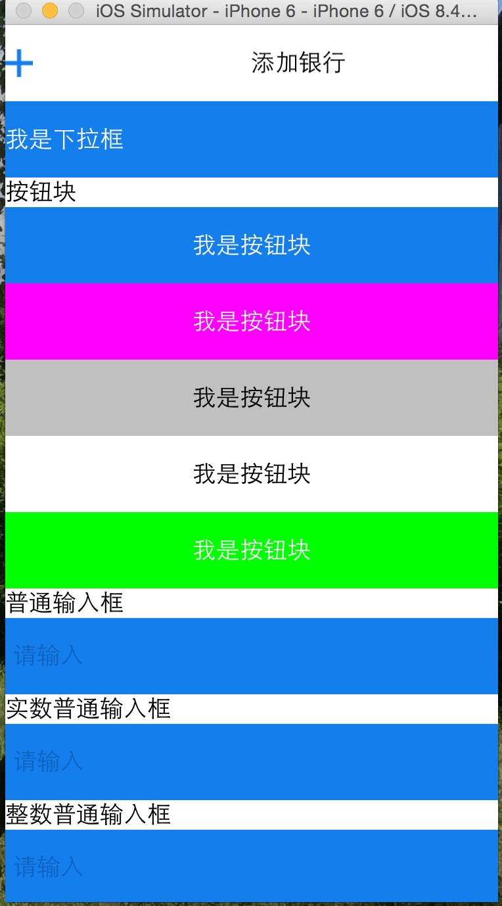

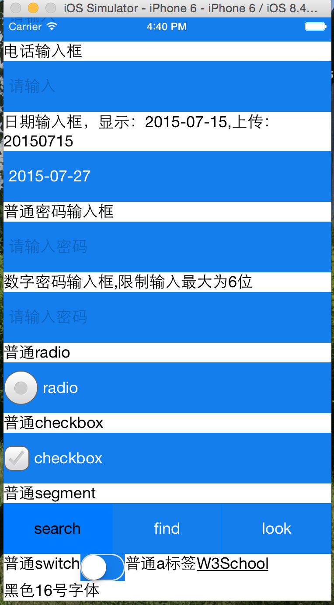

## 常见组合控件

### header

定义一些常用标题类型.

### header-1

__说明__

标题左边为图片和文字,中间为标题,右面为按钮，背景为蓝色,
有IOS7导航栏适配代码，如果为IOS7导航栏适配则自动加上一个20px的div。

__关键字__
`e_header1`

__图例__


### header-2

__说明:__

标题左边为按钮,中间为标题,右面为按钮，背景为白色

__图例:__

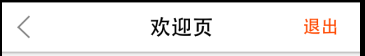

### header-3

__说明:__

标题栏左面按钮,中间图片,右面按钮

__图例:__

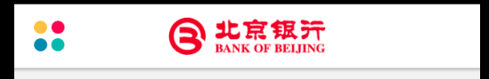

## checkbox

### checkbox-1

__说明:__

checkbox 选择记住手机号

__图例:__

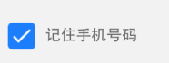

### checkbox-2

__说明:__

多个checkbox的选择,图标左对齐.

__图例:__

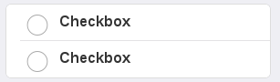

### checkbox-3

__说明:__

多个checkbox的选择,图标右对齐.

__图例:__

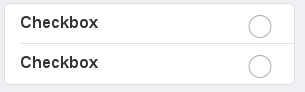

## radio

### radio-1

__说明:__

常见radio,图标左对齐

__图例:__

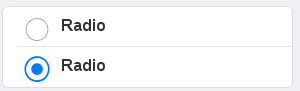

### radio-2

__说明:__

常见radio,图标右对齐

__图例:__

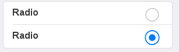

## switch

### switch-1

__说明:__

常见switch开关

__图例:__

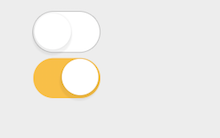

### switch-2

__说明:__

常见switch开关

__图例:__

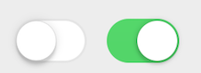

## select

### select-1

__说明:__

常见带下拉箭头的select控件.

__图例:__

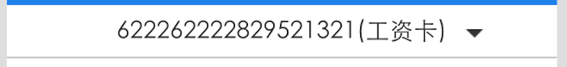

## segment

### segment-1

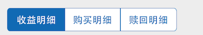

### segment-2

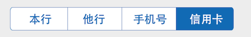

### segment-3

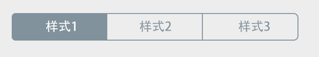

### segment-4

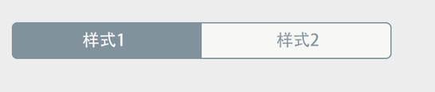

### segment-5

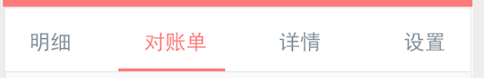

## button

### div-button

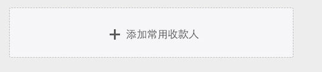

### button-1

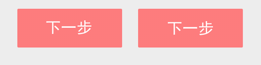

### button-2

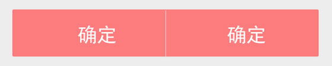

### button-3

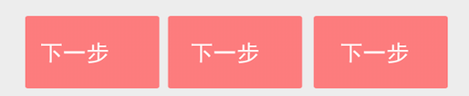

### button-4

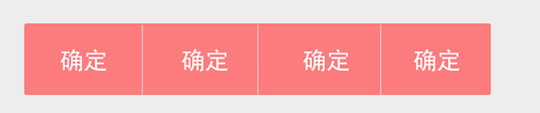

## menu

### menu-1

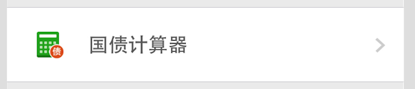

### menu-2

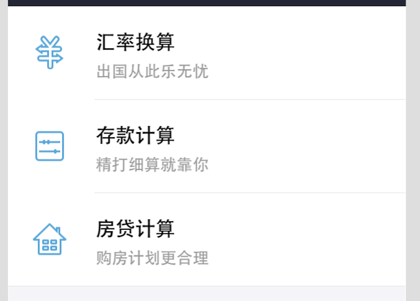

### menu-3

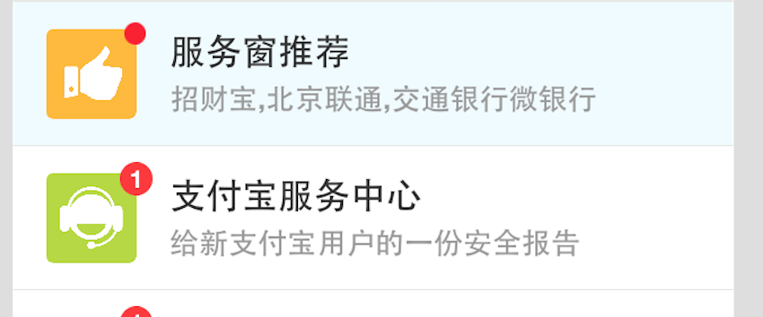

### menu-4

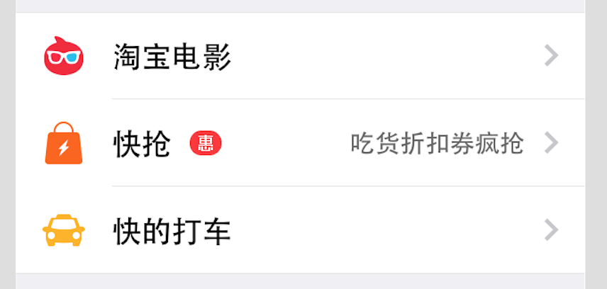

### menu-5

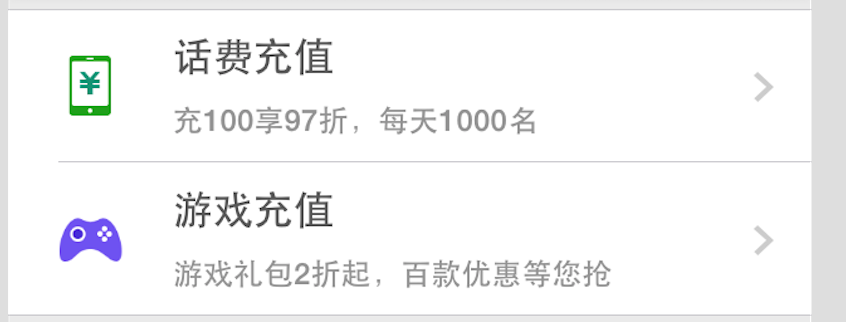

## div

### div-1

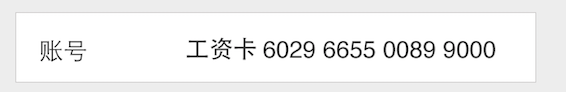

### div-2

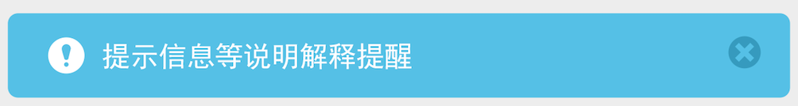

### div-3

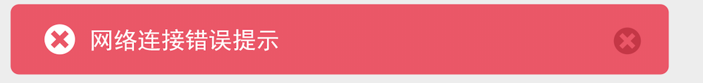

### div-4

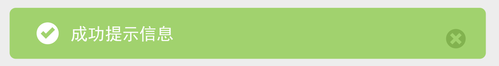

### div-5

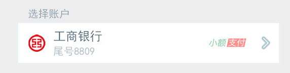

### div-6

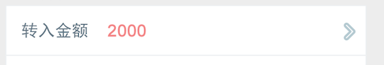

### div-7


### div-8

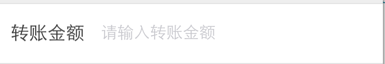

## td

### td-1

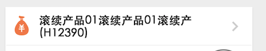

### td-2

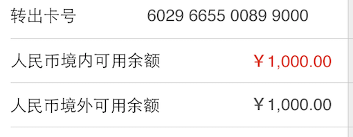

### td-3

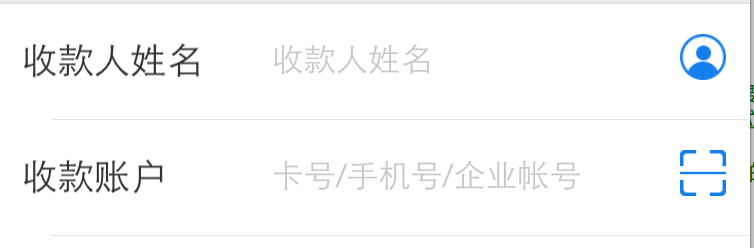

## footer

### footer-1

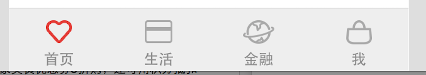

### footer-2

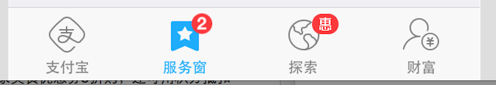
